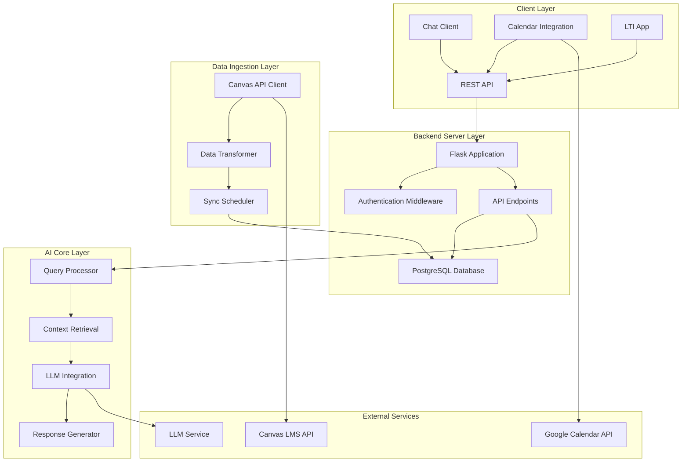

# Design Document

## Overview

The Canvas AI Assistant is a secure, modular backend service that provides students with intelligent access to their Canvas LMS data through natural language queries. The system follows a four-layer architecture pattern with clear separation of concerns: data ingestion, backend storage, AI processing, and client integration. The design emphasizes security, scalability, and maintainability while providing a conversational interface that eliminates the need for students to manually navigate multiple Canvas pages.

## Architecture

### System Architecture Diagram



### Layer Responsibilities

**Data Ingestion Layer**
- Authenticates with Canvas API using secure tokens
- Fetches and transforms Canvas data (courses, assignments, announcements, grades)
- Handles API rate limiting and error recovery
- Schedules periodic synchronization

**Backend Server Layer**
- Provides REST API endpoints for client applications
- Manages data persistence with PostgreSQL
- Implements authentication and authorization
- Handles request validation and error responses

**AI Core Layer**
- Processes natural language queries using NLP techniques
- Retrieves relevant context from stored Canvas data
- Integrates with LLM services (Gemini/Claude) for response generation
- Implements RAG (Retrieval-Augmented Generation) pattern

**Client Integration Layer**
- Supports multiple client interfaces (chat, calendar, LTI)
- Manages external service integrations
- Provides notification and event management

## Components and Interfaces

### Core Components

#### 1. Canvas API Client (`CanvasSync`)
```python
class CanvasSync:
    def __init__(self, canvas_url: str, api_token: str)
    def fetch_courses(self) -> List[Course]
    def fetch_assignments(self, course_id: str) -> List[Assignment]
    def fetch_announcements(self, course_id: str) -> List[Announcement]
    def fetch_grades(self, course_id: str) -> List[Grade]
    def sync_all_data(self) -> SyncResult
```

#### 2. Query Processor (`QueryEngine`)
```python
class QueryEngine:
    def __init__(self, database: Database, llm_client: LLMClient)
    def process_query(self, question: str) -> QueryResponse
    def extract_intent(self, question: str) -> QueryIntent
    def retrieve_context(self, intent: QueryIntent) -> List[DataItem]
    def generate_response(self, question: str, context: List[DataItem]) -> str
```

#### 3. Database Manager (`DatabaseManager`)
```python
class DatabaseManager:
    def __init__(self, connection_string: str)
    def store_assignments(self, assignments: List[Assignment]) -> None
    def store_announcements(self, announcements: List[Announcement]) -> None
    def store_grades(self, grades: List[Grade]) -> None
    def search_assignments(self, filters: Dict) -> List[Assignment]
    def search_announcements(self, filters: Dict) -> List[Announcement]
    def get_sync_status(self) -> SyncStatus
```

#### 4. API Handler (`FlaskApplication`)
```python
class APIHandler:
    def __init__(self, query_engine: QueryEngine, db_manager: DatabaseManager)
    def handle_ask_request(self, request: AskRequest) -> AskResponse
    def handle_health_check(self) -> HealthResponse
    def handle_data_request(self) -> DataResponse
    def validate_request(self, request: Any) -> ValidationResult
```

### Interface Specifications

#### REST API Endpoints

**POST /api/ask**
- Request: `{"question": "string"}`
- Response: `{"question": "string", "answer": "string", "timestamp": "ISO8601", "sources": ["string"]}`
- Status Codes: 200 (success), 400 (bad request), 500 (server error)

**GET /api/health**
- Response: `{"status": "healthy|degraded|unhealthy", "timestamp": "ISO8601", "components": {"database": "status", "canvas_api": "status", "llm": "status"}}`

**GET /api/data**
- Response: `{"assignments": [...], "announcements": [...], "grades": [...], "last_sync": "ISO8601"}`

**POST /api/sync**
- Request: `{"force": boolean}`
- Response: `{"status": "success|error", "message": "string", "sync_timestamp": "ISO8601"}`

#### Database Schema

**Courses Table**
```sql
CREATE TABLE courses (
    id VARCHAR(50) PRIMARY KEY,
    name VARCHAR(255) NOT NULL,
    code VARCHAR(50),
    term VARCHAR(50),
    created_at TIMESTAMP DEFAULT CURRENT_TIMESTAMP,
    updated_at TIMESTAMP DEFAULT CURRENT_TIMESTAMP
);
```

**Assignments Table**
```sql
CREATE TABLE assignments (
    id VARCHAR(50) PRIMARY KEY,
    course_id VARCHAR(50) REFERENCES courses(id),
    title VARCHAR(255) NOT NULL,
    description TEXT,
    due_date TIMESTAMP,
    points_possible DECIMAL(10,2),
    status VARCHAR(50),
    created_at TIMESTAMP DEFAULT CURRENT_TIMESTAMP,
    updated_at TIMESTAMP DEFAULT CURRENT_TIMESTAMP
);
```

**Announcements Table**
```sql
CREATE TABLE announcements (
    id VARCHAR(50) PRIMARY KEY,
    course_id VARCHAR(50) REFERENCES courses(id),
    title VARCHAR(255) NOT NULL,
    content TEXT,
    posted_date TIMESTAMP,
    created_at TIMESTAMP DEFAULT CURRENT_TIMESTAMP,
    updated_at TIMESTAMP DEFAULT CURRENT_TIMESTAMP
);
```

**Grades Table**
```sql
CREATE TABLE grades (
    id SERIAL PRIMARY KEY,
    course_id VARCHAR(50) REFERENCES courses(id),
    assignment_id VARCHAR(50) REFERENCES assignments(id),
    score DECIMAL(10,2),
    grade VARCHAR(10),
    feedback TEXT,
    graded_at TIMESTAMP,
    created_at TIMESTAMP DEFAULT CURRENT_TIMESTAMP,
    updated_at TIMESTAMP DEFAULT CURRENT_TIMESTAMP
);
```

## Data Models

### Core Data Models

#### Assignment Model
```python
@dataclass
class Assignment:
    id: str
    course_id: str
    title: str
    description: Optional[str]
    due_date: Optional[datetime]
    points_possible: Optional[float]
    status: AssignmentStatus
    created_at: datetime
    updated_at: datetime
```

#### Announcement Model
```python
@dataclass
class Announcement:
    id: str
    course_id: str
    title: str
    content: str
    posted_date: datetime
    created_at: datetime
    updated_at: datetime
```

#### Grade Model
```python
@dataclass
class Grade:
    id: int
    course_id: str
    assignment_id: str
    score: Optional[float]
    grade: Optional[str]
    feedback: Optional[str]
    graded_at: Optional[datetime]
    created_at: datetime
    updated_at: datetime
```

#### Query Models
```python
@dataclass
class QueryIntent:
    intent_type: IntentType  # ASSIGNMENT, GRADE, ANNOUNCEMENT, SCHEDULE
    entities: Dict[str, Any]  # course_name, date_range, assignment_name
    confidence: float

@dataclass
class QueryResponse:
    question: str
    answer: str
    sources: List[str]
    timestamp: datetime
    confidence: float
```

## Error Handling

### Error Categories and Responses

#### 1. Canvas API Errors
- **Connection Errors**: Retry with exponential backoff (max 3 attempts)
- **Authentication Errors**: Log error, notify admin, return 401 status
- **Rate Limiting**: Implement request queuing with appropriate delays
- **Data Format Errors**: Log error, skip malformed records, continue processing

#### 2. Database Errors
- **Connection Failures**: Implement connection pooling with retry logic
- **Constraint Violations**: Log error, skip duplicate records
- **Query Timeouts**: Implement query optimization and timeout handling

#### 3. LLM Integration Errors
- **API Unavailable**: Fallback to template-based responses
- **Token Limits**: Implement context truncation strategies
- **Response Parsing**: Validate and sanitize LLM responses

#### 4. Client Request Errors
- **Invalid Input**: Return 400 with descriptive error messages
- **Missing Parameters**: Return 400 with required parameter list
- **Malformed JSON**: Return 400 with parsing error details

### Error Response Format
```json
{
    "error": {
        "code": "ERROR_CODE",
        "message": "Human-readable error description",
        "details": "Additional technical details",
        "timestamp": "2024-02-15T10:30:00Z"
    }
}
```

## Testing Strategy

### Unit Testing
- **Component Testing**: Test individual classes and methods in isolation
- **Mock Dependencies**: Use mocks for external services (Canvas API, LLM, Database)
- **Coverage Target**: Maintain 80%+ code coverage for core business logic
- **Test Framework**: pytest with fixtures for common test data

### Integration Testing
- **API Endpoint Testing**: Test complete request/response cycles
- **Database Integration**: Test data persistence and retrieval operations
- **Canvas API Integration**: Test with Canvas API sandbox environment
- **End-to-End Scenarios**: Test complete user workflows

### Performance Testing
- **Load Testing**: Simulate concurrent user requests
- **Database Performance**: Test query performance with realistic data volumes
- **Memory Usage**: Monitor memory consumption during sync operations
- **Response Time**: Ensure API responses under 2 seconds for 95% of requests

### Security Testing
- **Input Validation**: Test SQL injection and XSS prevention
- **Authentication**: Test token validation and authorization
- **Data Encryption**: Verify encryption of sensitive data at rest and in transit
- **API Security**: Test rate limiting and request validation

### Test Data Management
- **Mock Data**: Comprehensive mock Canvas data for development
- **Test Database**: Separate test database with known data sets
- **Fixtures**: Reusable test fixtures for common scenarios
- **Cleanup**: Automated test data cleanup after test execution